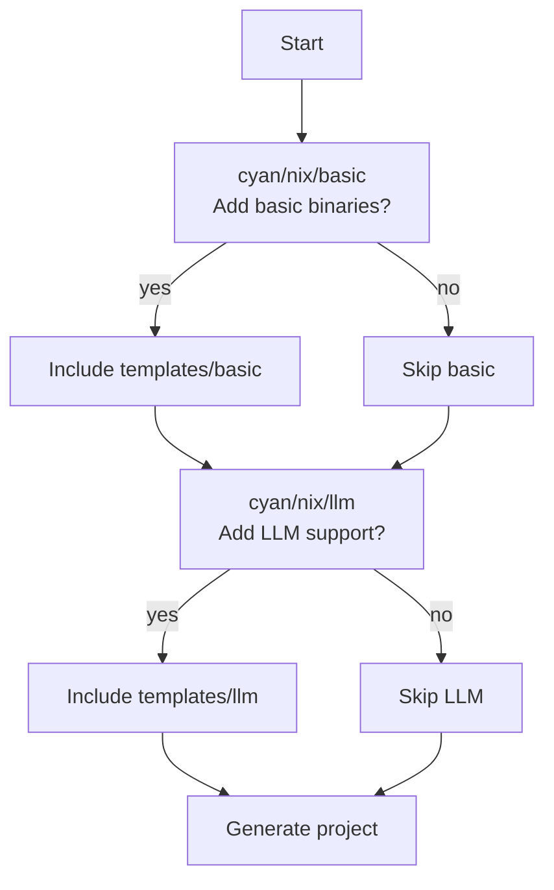

# atomi/nix

AtomiCloud's nix template — generates a Nix-based project scaffold with optional basic binaries and LLM support (ClaUDE.md and skills).

## Usage

### Run directly

To create a new project from this template:

```bash
cyanprint create atomi/nix
```

### Reference in a parent template

To use this template as a dependency in another CyanPrint template's `cyan.yaml`:

```yaml
templates: [atomi/nix]
processors: [cyan/default]
resolvers:
  - resolver: atomi/md
    config: {}
    files: ['CLAUDE.md', 'README.md', '.envrc']
  - resolver: atomi/nix
    config: {}
    files: ['nix/env.nix', 'nix/packages.nix', 'nix/fmt.nix', 'nix/pre-commit.nix', 'nix/shells.nix', 'flake.nix']
  - resolver: atomi/ignore
    config: {}
    files: ['.gitignore']
```

## Prompts

When you run `cyanprint create`, the template will ask the following questions:

| Prompt ID      | Description                               | Type   |
| -------------- | ----------------------------------------- | ------ |
| `cyan/nix/basic` | Add basic binaries (coreutils etc)?       | select |
| `cyan/nix/llm`   | Add LLM support (CLAUDE.md and skills)?   | select |

### Prompt flow



- **base** — always included (core nix flake and shell configuration)
- **basic** — included only when `cyan/nix/basic` = `yes` (adds coreutils and common binaries)
- **llm** — included only when `cyan/nix/llm` = `yes` (adds CLAUDE.md and Claude Code skills)

## Dependencies

| Name                  | Version  | Purpose                       | Usage                                               |
| --------------------- | -------- | ----------------------------- | --------------------------------------------------- |
| Node.js / Bun         | —        | Runtime for template entry    | Executes `cyan/index.ts` via `StartTemplateWithLambda` |
| `@atomicloud/cyan-sdk` | ^2.1.0  | CyanPrint template SDK        | Provides `StartTemplateWithLambda`, `GlobType`      |
| `cyan/default`        | latest   | Variable substitution processor | Processes template files from `templates/{layer}`  |
| `atomi/md`            | latest   | Markdown resolver             | Merges `CLAUDE.md`, `README.md`, `.envrc`          |
| `atomi/nix`           | latest   | Nix file resolver             | Merges nix config files (`flake.nix`, `env.nix`, etc.) |
| `atomi/ignore`        | latest   | Gitignore resolver            | Merges `.gitignore` entries                         |

## Build and Publish

Images are built for `linux/amd64` and `linux/arm64` and pushed to the configured registry:

```bash
# Build and push (requires tag)
cyanprint push --token TOKEN --message "commit message" template --build v1.0.0

# Push only (no build)
cyanprint push --token TOKEN --message "commit message" template
```
