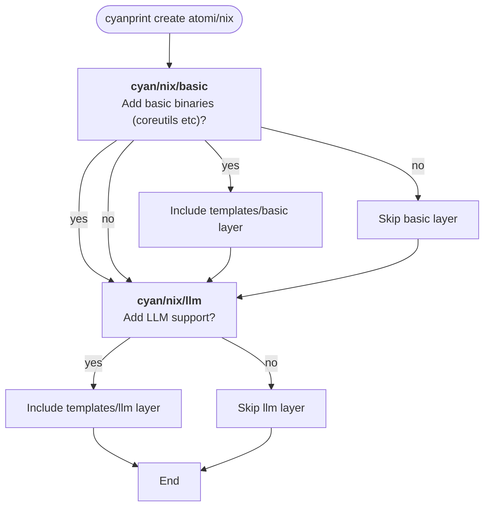

# atomi/nix

AtomiCloud's nix template — generates a modular Nix flake project with direnv, treefmt, and pre-commit hooks.

## Usage

### Run directly

To create a new project from this template:

```bash
cyanprint create atomi/nix
```

### Reference in a parent template

To use this template as a dependency in another CyanPrint template's `cyan.yaml`:

```yaml
templates: [atomi/nix]
processors: [cyan/default]
resolvers:
  - resolver: atomi/md
    config: {}
    files: ['CLAUDE.md', 'README.md', '.envrc']
  - resolver: atomi/nix
    config: {}
    files: ['nix/env.nix', 'nix/packages.nix', 'nix/fmt.nix', 'nix/pre-commit.nix', 'nix/shells.nix', 'flake.nix']
  - resolver: atomi/ignore
    config: {}
    files: ['.gitignore']
```

## Prompts

When you run `cyanprint create`, the template will ask the following questions:

| Prompt ID | Description | Type | Options |
| --- | --- | --- | --- |
| `cyan/nix/basic` | Add basic binaries (coreutils etc)? | select | `yes`, `no` |
| `cyan/nix/llm` | Add LLM support (CLAUDE.md and skills)? | select | `yes`, `no` |

### Prompt flow



## Dependencies

| Name | Version | Purpose | Usage |
| --- | --- | --- | --- |
| `@atomicloud/cyan-sdk` | ^2.1.0 | CyanPrint Template SDK | Provides `StartTemplateWithLambda`, `GlobType` for template entry point |
| `cyan/default` | latest | Default CyanPrint processor | Processes template files from `templates/base`, `templates/basic`, and `templates/llm` |
| `atomi/md` | latest | Markdown resolver | Merges `CLAUDE.md`, `README.md`, `.envrc` files |
| `atomi/nix` | latest | Nix resolver | Merges `nix/*.nix` and `flake.nix` files |
| `atomi/ignore` | latest | Ignore file resolver | Merges `.gitignore` files |

## Generated output

The template produces a Nix flake project with:

- **`flake.nix`** — central orchestrator with nixpkgs, atomipkgs, treefmt, and pre-commit inputs
- **`nix/packages.nix`** — aggregate packages from registries
- **`nix/env.nix`** — group packages by purpose (system, dev, main, lint)
- **`nix/shells.nix`** — define dev environments composing env groups
- **`nix/fmt.nix`** — configure formatters via treefmt
- **`nix/pre-commit.nix`** — configure git hooks
- **`.envrc`** — direnv auto-loading
- **`.gitignore`** — standard nix ignores
- **`docs/developer/standard/nix.md`** — full nix configuration guide

When **basic** is selected, additional coreutils packages are included in `env.nix` and `packages.nix`. When **LLM** is selected, `CLAUDE.md` and `.claude/skills/nix/` are added for Claude Code integration.

## Build and Publish

```bash
# Build and push (requires tag argument for --build)
cyanprint push --token TOKEN --message "commit message" template --build v1.0.0

# Push only (no build)
cyanprint push --token TOKEN --message "commit message" template
```

Built images are pushed to `${DOMAIN:-docker.io}/${GITHUB_REPO_REF:-atomi}` for `linux/amd64` and `linux/arm64`.
